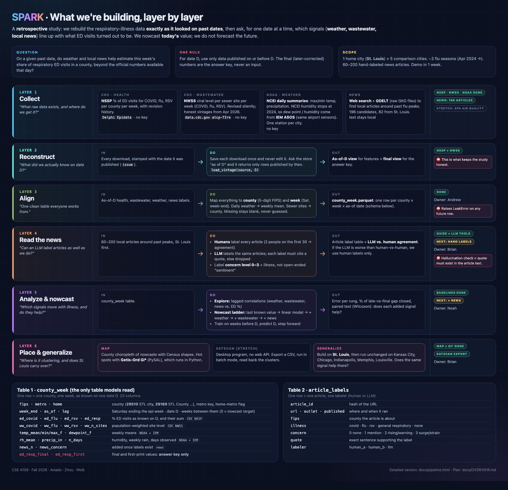

# Using Local Data to Nowcast and Track County-Level Outbreaks

Andrew Aviado · Brian Zhou · Noah Wolk
CSE 4109: Introduction to AI for Health, Fall 2026 · Washington University in St. Louis



Plan and hypotheses: [`docs/OVERVIEW.md`](docs/OVERVIEW.md) · detailed
pipeline: [`docs/pipeline.png`](docs/pipeline.png) · news labeling rules:
[`docs/LABELING_GUIDE.md`](docs/LABELING_GUIDE.md)

## The question

Emergency department (ED) visit counts and wastewater readings come out one to
two weeks late, and the early numbers keep changing for weeks after that. Local
news covers outbreaks sooner, but as plain text, not data.

This is a **retrospective** study. We rebuild every source exactly as it looked
on each past date, then ask: on that date, do weather, wastewater, and
LLM-labeled local news help estimate this week's share of respiratory ED
visits in a county, **beyond the official numbers public that day**? We
nowcast the current week; we do not forecast. A "no" is still a result.

St. Louis is the home metro; Kansas City, Chicago, Indianapolis, Memphis and
Louisville test whether the result carries over (`src/study.py`).

## What the data taught us (verified Oct 2026)

These shaped the design more than anything we planned.

1. **Official numbers get revised, a lot.** At the January 2026 flu peak, 19%
   of US counties' first published ED value was later revised by ≥10%, mostly
   upward. So every model trains and scores on a **vintage**: the data exactly
   as published on the prediction date.
2. **Missouri was invisible in real time.** NSSP published *nothing* for any
   Missouri county, including St. Louis and Kansas City, until June 2026,
   when two years of history appeared at once. For our home metro, the
   official number simply did not exist on most prediction dates.
3. **Missouri's 2024–25 history is not trustworthy.** In the back-filled data
   the January 2025 peak shows a median of 0.2% across all 115 Missouri
   counties, versus 7.8% in Chicago. That is incomplete facility reporting, not
   a mild season. Treat Missouri labels before ~Aug 2025 as suspect.
4. **St. Louis city and County are one series.** NSSP gives 29510 and 29189
   identical values in every signal; models count them once.
5. **Wastewater is revised too, invisibly.** CDC re-posts the whole NWSS history
   every Friday with one timestamp; in Aug 2026 it changed the method and
   rescaled history back to 2022 (31% of site-weeks changed category). Honest
   wastewater vintages exist only from **2026-04-17** (recovered from the
   Wayback Machine). Earlier weeks are available only as a labeled
   approximation (`allow_proxy=True`).
6. **NOAA stopped publishing humidity.** NCEI daily summaries have no dew point
   or humidity after 2024-12-31 at any study station. Humidity comes from the
   Iowa Environmental Mesonet copy of the same airport sensors (r = 0.999 with
   NCEI over 2024).
7. **`as_of` takes an epiweek, not a date.** `as_of=20260215` is silently read
   as a far-future week and returns the *latest* data. The ingester refuses it.

## First results (baselines, no news yet)

Rolling-origin backtest on the four metros with real-time data, scored against
final values (`data/results/`, `python -m src.nowcast`). Skill = 1 − MAE / MAE of
the reference rung.

| Setting | Best rung | What adding signals did |
| --- | --- | --- |
| Official data available (462 county-weeks) | **Carry last value forward** (MAE 0.72) | AR + season, weather, wastewater all *worse* (skill −0.15 to −0.20) |
| No official data, held-out metro (436) | **Season only** (skill +0.35 vs mean) | Weather slightly worse than season alone (p<0.001) |

Honest reading: weather looked useful at first (+22%), but that was the time
of year; it adds nothing beyond season. Wastewater is effectively untested
until more honest vintages accumulate. News, the actual hypothesis, is next:
it needs the hand labels.

## Data

| Source | What it gives us | Module | Status |
| --- | --- | --- | --- |
| **CDC NSSP** via Delphi Epidata | **Target**: % of ED visits for COVID, flu, RSV; county, weekly, with revision history | `src/ingest_nssp.py`, `src/backfill_nssp.py` | ✅ 129 weekly vintages, Apr 2024 → |
| **CDC NWSS** wastewater (`atcp-73re`) | Weekly viral activity level per sewer site, mapped to county | `src/ingest_nwss.py`, `src/fips.py` | ✅ honest from 2026-04-17 |
| **NOAA NCEI** + **IEM ASOS** | Daily temp, precip (NCEI); dew point, humidity (IEM); one airport per metro, no key | `src/ingest_noaa.py` | ✅ 2024-01 → today |
| **Local news** (web search + GDELT GKG files) | 196 candidate articles, 173 with text; 82 St. Louis | `src/news/collect.py`, `src/news/fetch.py` | ✅ ready to hand-label |
| Census county shapes + population | Map, hot spots, SaTScan inputs | `src/spatial/shapes.py` | ✅ |
| EPA AirNow | PM2.5, ozone | – | Deferred |

## Pipeline

```
collect        ingest_nssp / backfill_nssp · ingest_nwss · ingest_noaa · news.collect → news.fetch
reconstruct    SnapshotStore.load_vintage(source, D)   ← the only door into features
label news     humans: labels/human_labels.csv   LLM: news.label → news.ground (quote check)
validate       news.agreement (Cohen's κ, LLM vs human)   news.baseline (VADER)
align          align → data/county_week.parquet   (raises LeakError on any future row)
model          nowcast → data/results/   (naive → AR+season → +weather → +wastewater → +news)
place          spatial.hotspots (Getis-Ord Gi*) · spatial.map · spatial.satscan (export)
```

### Running it

```bash
# weekly collection: run every week; a missed NWSS Friday is lost for good
python -m src.ingest_nssp                 # today's NSSP vintage, all counties
python -m src.ingest_nwss                 # today's wastewater vintage
python -m src.ingest_noaa                 # weather through yesterday

# one-time history
python -m src.backfill_nssp               # study-county vintages since 202416 (resumable)
python -m src.ingest_nwss --archive       # recover past NWSS vintages from the Wayback Machine

# news
python -m src.news.fetch                  # download text for labels/articles.csv → raw/news/
export ANTHROPIC_API_KEY=...              # only for the LLM labeler
python -m src.news.label --runs 2 && python -m src.news.ground
python -m src.news.baseline && python -m src.news.agreement   # → data/labels/agreement_report.md

# table, models, map
python -m src.align && python -m src.nowcast
python -m src.spatial.map --week 2025-12-27 --out demo/map.html
```

## Data collection protocol

1. **Run the weekly collection every week**, ideally Saturday. NSSP history
   can be rebuilt later; NWSS vintages cannot.
2. **Read the target only through a vintage.** `load_vintage(source, as_of)`
   for anything that trains or scores; `latest_vintage` only for plots and
   final labels.
3. **Snapshots are never edited.** A correction goes in under a new issue date.
4. **Data never goes in git.** `raw/` and `data/` are gitignored; share
   snapshots through Box. Article text stays local (copyright); only the URL
   catalog (`labels/articles.csv`) and our own labels are committed.
5. **Hand labels follow `docs/LABELING_GUIDE.md`.** Copy
   `labels/human_template.csv` to `labels/human_labels.csv`; two people label
   the same first 30 articles; hide the `stratum` column from labelers.

## Setup

```bash
git clone https://github.com/DoDaDrew18/CSE4109-SPARKProject.git
cd CSE4109-SPARKProject
python3 -m venv .venv && source .venv/bin/activate
pip install -r requirements.txt     # wheels only; no GDAL or compiler needed
python -m pytest tests/ -q          # expect 169 passed, all offline
```

Delphi limits anonymous use to ~60 requests/hour. A free key
(`--api-key`) makes the backfill and map fetches much faster.

## Layout

```
src/study.py           metros, counties, NOAA stations, week convention
src/snapshot.py        append-only snapshot store + vintage loader
src/ingest_nssp.py     NSSP target ingestion (today, or --as-of epiweek)
src/backfill_nssp.py   rebuild weekly NSSP vintages for the study counties
src/ingest_nwss.py     wastewater vintages + weekly county features
src/ingest_noaa.py     NCEI + IEM weather, weekly features with availability lag
src/fips.py            county name → FIPS (Census reference file)
src/align.py           county_week table with leak checks
src/nowcast.py         rolling-origin model ladder
src/evaluate.py        MAE, R², gap closed, skill, Wilcoxon
src/news/              collect, fetch, label (LLM), ground, agreement, baseline, features
src/spatial/           shapes, hot spots (Gi*, local Moran), map, SaTScan export
labels/                article catalog + human label template (committed)
docs/                  overview, schematic, pipeline chart, labeling guide
demo/                  St. Louis map views + screenshots
tests/                 pytest suite (offline; no network needed)
raw/, data/            snapshots, pulls, derived tables (gitignored)
```

## Team

| Member | Role | Owns |
| --- | --- | --- |
| Andrew Aviado | Data Lead | Ingestion, county/week alignment, vintage handling |
| Noah Wolk | ML Engineer | Baselines, nowcasting models, backtesting, ablations |
| Brian Zhou | Software Engineer | LLM extraction and validation, map, demo |

## Status

- [x] Snapshot store and vintage loader
- [x] NSSP ingestion + weekly vintage backfill for study counties
- [x] Study counties chosen (STL + 5 comparison metros)
- [x] NWSS wastewater ingestion (honest vintages from 2026-04-17)
- [x] NOAA/IEM weather ingestion
- [x] Aligned county-week table with leak checks
- [x] Baseline ladder + evaluation (naive, AR+season, weather, wastewater)
- [x] News candidate corpus (196 articles) + labeling guide
- [x] LLM labeler, quote-grounding check, agreement report (tested offline)
- [x] Map with Gi* hot spots; SaTScan input export
- [ ] **Hand-label 60–200 articles** (two labelers on the first 30)
- [ ] Run the LLM labeler (needs `ANTHROPIC_API_KEY`) and the agreement report
- [ ] News rung in the ladder; ablation
- [ ] Decide how to treat Missouri labels before Aug 2025
- [ ] Natural-language search on the map (Demo II)
